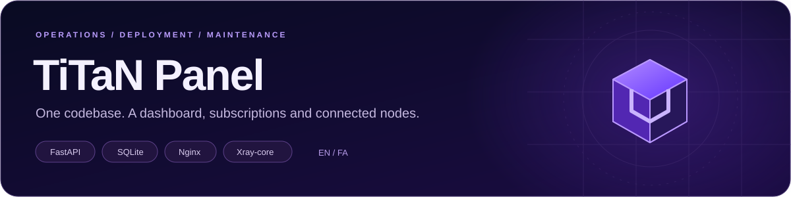

<a id="top"></a>
<div align="center">



# 🇬🇧 The TiTaN operator’s guide

**From the first login to a maintained deployment.**

[Home](../../README.md) · [🇮🇷 فارسی](../fa/README.md) · [Environment reference](../environment.md)

</div>

---

**On this page**<br>
[Overview](#overview) · [Requirements](#requirements) · [Local setup](#local) · [Docker](#docker) · [Railway](#railway) · [Dashboard](#dashboard) · [Subscriptions](#subscriptions) · [Nodes](#nodes) · [Clients](#clients) · [Configuration](#configuration) · [Troubleshooting](#troubleshooting) · [Maintenance](#maintenance) · [Limits](#limitations)

<a id="overview"></a>
## 01 / What TiTaN does

TiTaN creates and manages proxy users and connection configurations. The backend is **FastAPI**, persistence is **SQLite**, and **Xray-core** carries proxy traffic. Nginx routes the public HTTP entry point to the panel and the supported HTTP transports.

The same repository has two deployment roles:

- **Main** — owns users, settings and subscriptions; serves the dashboard; pushes user configuration to remote nodes.
- **Node** — receives synchronized users, runs its proxy service and reports traffic deltas to the main panel.

```text
Browser / compatible client
             │
      Public domain + TLS
             │
           Nginx
             ├── /login, /dashboard, /api/*, /p/*, /s/* → FastAPI → SQLite
             ├── /vl-ws, /vm-ws, /tr-ws                → Xray WebSocket
             ├── /xhttp, /hup                         → Xray HTTP transports
             └── /titan                               → Xray gRPC

Main panel ── configuration sync ──► remote node
Main panel ◄── traffic reports ───── remote node
```

The public subscription page is part of the **same service**, not a second frontend to install.

### Where things live

| Path | Responsibility |
| :--- | :--- |
| `app/main.py` | Page routes, REST endpoints, subscription responses and request validation |
| `app/db.py` | SQLite persistence, users, nodes, subscriptions, settings and events |
| `app/nodes.py` / `app/routing.py` | Node credentials, synchronization, target selection and fallback decisions |
| `app/geo.py` | Node-specific location estimates and country/flag normalization |
| `app/xray.py` / `app/links.py` | Xray configuration, traffic statistics and connection links |
| `app/reality.py` / `app/wg.py` / `app/sskeys.py` | Protocol-specific keys/configuration |
| `app/tasks.py` / `app/state.py` | Background work and process-local state |
| `templates/` | Login, dashboard, public subscription and public status pages |
| `static/js/` | Shared messages, dashboard UI bindings and country flags |
| `static/data/countries.json` | Country codes and Persian/English names |
| `tests/` / `scripts/` | Regression tests, local development and verification tools |

<a id="requirements"></a>
## 02 / Requirements

### UI and API development

- Python **3.11 or newer** is recommended; use an isolated virtual environment.
- Packages in `requirements.txt`.
- A writable data directory.
- A modern browser. Node.js is needed only for the JavaScript checks, not for the application server.

### Actual proxy service

- A compatible **Xray-core** binary and accessible ingress ports.
- **Nginx** for the packaged HTTP transport routes, or an equivalent correctly configured proxy.
- A public domain and TLS termination for HTTPS-based client links.
- Persistent storage for each instance’s database.
- For optional WireGuard: a compatible userspace binary, `/dev/net/tun`, `NET_ADMIN`, UDP exposure and host routing/NAT.

> The Dockerfile downloads **Linux x86-64** binaries. ARM-native images are not supplied by this repository. Docker on Windows/macOS can use an appropriate Linux/amd64 engine or emulation; native Windows/macOS proxy deployment is not documented as a supported packaged path.

<a id="local"></a>
## 03 / Installation and local setup

```bash
git clone https://github.com/rashiditestm-dot/test-titanoo.git
cd test-titanoo
python3 -m venv .venv
. .venv/bin/activate
pip install -r requirements.txt
mkdir -p data
export TITAN_DATA_DIR="$PWD/data"
export TITAN_XRAY_CONFIG="$PWD/data/xray.json"
python -m uvicorn app.main:app --host 0.0.0.0 --port 8000 --no-proxy-headers
```

Open `http://localhost:8000/login`. For a new database, the password is **`TiTaN`**, unless you exported `TITAN_ADMIN_PASS` before the first boot. Empty passwords are not accepted.

For PowerShell, activate with `.venv\Scripts\Activate.ps1` and set variables before starting Uvicorn:

```powershell
$env:TITAN_DATA_DIR = "$PWD\data"
$env:TITAN_XRAY_CONFIG = "$PWD\data\xray.json"
python -m uvicorn app.main:app --host 0.0.0.0 --port 8000 --no-proxy-headers
```

Without Xray, the panel starts in **development/mock mode**. You can exercise the UI and API; the generated links do not carry real traffic. Starting Uvicorn alone also does not install Nginx’s `/vl-ws` and related routes. Use the container or configure the complete ingress stack for a real connection test.

The existing `scripts/dev_run.sh` starts a reload-enabled development server. `scripts/fetch_xray.py` downloads a Linux x64 binary into `/usr/local/bin`; it needs appropriate filesystem permissions and is not a cross-platform installer.

### Environment variables

There is **no automatic `.env` loader** in the Python application. Export variables into the process, use Docker’s `--env-file`, or configure Railway’s Variables tab. See the [complete environment reference](../environment.md) for defaults and host-specific settings.

<a id="docker"></a>
## 04 / Docker

```bash
docker build --platform linux/amd64 -t titan-panel .
docker volume create titan-data

# Set a strong value locally; do not commit it.
export TITAN_ADMIN_PASS='replace-with-a-long-random-password'
docker run -d --name titan --restart unless-stopped \
  --platform linux/amd64 \
  -p 8000:8000 \
  -v titan-data:/app/data \
  -e TITAN_ADMIN_PASS \
  titan-panel
```

- The example publishes local **HTTP on port 8000**. Put proper TLS termination in front of it before distributing TLS-enabled configs.
- `/app/data` keeps the database, uploaded gallery images and backups. Do not remove the volume on updates.
- Keep one application process/replica per database; do not run a fleet by sharing one SQLite file.
- Raw TCP and UDP transports need their own published ports. Publishing `8000` alone is not enough for Reality, Shadowsocks, Hysteria2 or WireGuard.

<a id="railway"></a>
## 05 / Railway deployment

1. Fork or push the source to a repository you control.
2. In Railway, create a service from that repository. Keep the included **Dockerfile** builder and `railway.json` startup configuration.
3. Attach a persistent volume at **`/app/data`**. If you choose another mount point, set `TITAN_DATA_DIR` to that exact writable path.
4. Set a strong **`TITAN_ADMIN_PASS` before first boot**. Keep `TITAN_ADMIN_USER=TiTaN` for the shipped password-only login form.
5. Generate a public domain or attach your own. The public networking target must match the container’s exposed HTTP port (`PORT`). The internal panel port defaults to `10000`; Nginx fronts it.
6. Confirm that **`/healthz`** answers. The included Railway descriptor uses this health-check path and a 30-second health-check timeout.
7. Open `/login`, sign in, change the initial password and configure the public domain in Settings.
8. Create a small test user. Import its link into a compatible client and test **actual traffic**, not just the panel health check.

A generated Railway public domain normally enables `TITAN_EDGE_HTTP_ONLY` detection. Use HTTP-edge transports such as WS/XHTTP where supported end to end. gRPC depends on the full proxy chain’s HTTP/2 support. Raw TCP requires an explicitly configured TCP proxy; the advertised external port must map to the **correct internal inbound**. UDP is not provided by the normal HTTP/TCP public edge, so do not promise Hysteria2 or WireGuard through that path.

> **Persistence is essential.** Replacing an ephemeral filesystem can lose users, subscriptions, node credentials, session signing material and Reality/WireGuard keys. Setting a password variable again does not restore these records.

`render.yaml` remains available for Render. It uses the same container and `/health`; it does **not** provision a persistent disk. Check the host’s current storage and networking options instead of assuming a free plan will preserve data.

<a id="dashboard"></a>
## 06 / Set up the dashboard

1. **Security:** change the initial password under **Settings → Security**. Enter the current password; the initial value is not an empty string.
2. **Public domain:** enter the hostname clients should use, without a subscription path. Set the public link port, usually `443` behind HTTPS. When the domain is empty, the backend derives a host from the request; set it explicitly for predictable external links.
3. **Language:** use **Settings → General → Panel language**. The choice is stored in the browser and shared with the login and subscription pages. Names, notes, domains and configuration payloads are not translated.
4. **User/config:** open Users or Configs, select the add icon, enter a name and choose the protocol, transport, security and target node.
5. **Limits:** choose the quota unit/amount and expiry days. A zero quota or zero expiry-days value means no corresponding limit. Device/IP/request fields have the limitations explained below.
6. **Share:** use the connection-copy action or QR action. Use the subscription builder when you want several configs in one import URL.
7. **Verify:** use the node health/sync information and **Tools → Connection test**. A reachable panel is not proof that every inbound port works.

There is one persisted administrator account. The visible extra-admin/role controls do not constitute a complete multi-admin/RBAC implementation. The login page’s help buttons display guidance; there is no email password-reset or social-login service behind them.

<a id="subscriptions"></a>
## 07 / Set up the subscription panel

No second deployment, package install or frontend build is required.

1. Create one or more users/configs.
2. Open **Subscriptions** and choose **New subscription link**.
3. Enter a name, select the users’ config chips and optionally choose a link image and a plan label.
4. Save. The dashboard can copy the import URL, copy the browser-page URL, show QR, edit selection or switch the link on/off.

| Address | Intended use |
| :--- | :--- |
| `/sub/{uid}` | Existing per-user subscription |
| `/s/{token}` | Group subscription: browser navigation gets the page; clients get the existing encoded payload |
| `/s/{token}?raw=1` or `/s/{token}/base64` | Explicit client payload |
| `/s/{token}/json` | Existing structured/debug representation |
| `/p/{token}` | Public human-readable subscription page |
| `/p/{token}/data` | Data used by that page |
| `/status/{uid}` | Existing compact per-user public status page |

The page shows usage, expiry, selected configs and client actions. It refreshes on return to the tab/reconnection. When the group link is disabled, its human page still opens, but its config list/URL is withheld and the client-facing endpoint returns **403**. Disabling this link does not revoke an individual connection URI already copied by a client; that is a separate user/config operation.

Treat subscription URLs and QR codes as **credentials**. Anyone with a valid token can access its public page and available configs. A plan title is a display label, not a billing integration.

For a multi-user link, usage and numeric quotas are summed. The page displays the earliest dated-user expiry, while current client metadata uses the latest expiry. Mixed unlimited/limited users are not a single pooled quota. These existing semantics are unchanged.

<a id="nodes"></a>
## 08 / Add and operate nodes

### Prepare the node service

Deploy the same image as a **separate service**, with its own data volume and public HTTPS domain:

```dotenv
TITAN_ROLE=node
TITAN_NODE_NAME=Amsterdam-01
```

On Railway, `TITAN_NODE_URL` can be derived from `RAILWAY_PUBLIC_DOMAIN`. Elsewhere, set it to the node’s public URL. The node must have a working Xray/ingress setup; adding its name to the dashboard does not provision a server.

### Connect it from the main panel

1. In **Nodes**, select the add icon and enter the node domain/origin. A custom port is allowed.
2. Select **Auto-detect from domain**. The main panel contacts that node’s discovery endpoint; available name and location fields are filled in.
3. Check the location. If it cannot be verified, enter the country/city yourself; a two-letter country code such as `NL` or `AE` makes the flag unambiguous.
4. Save. A fresh unclaimed node can receive the panel’s fleet credential automatically. The panel then attempts an immediate sync.
5. If synchronization is not ready, use the setup dialog’s **copy-all variables** action. It supplies the existing `TITAN_ROLE`, `TITAN_NODE_TOKEN`, `TITAN_NODE_URL` and `TITAN_MAIN_URL` values. Apply them to the node service and redeploy.
6. Assign a user to the node and confirm sync status. **Auto** selection uses measured, online, synchronized candidates; the panel remains the existing fallback when a node is not eligible to serve a user.

For a manually preconfigured fleet, set the same strong `TITAN_NODE_SECRET` on the main panel and the intended nodes, plus the node’s `TITAN_MAIN_URL`/public URL. Do not publish tokens or the shared secret in screenshots, issues or Git.

> **Bootstrap is trust-on-first-use.** A node without a configured/stored credential can be claimed by the first caller. Protect it while provisioning, or preconfigure a shared secret/per-node token before exposing it. This maintenance pass does not change that authentication model.

### How location detection works

- An updated node estimates its location from **its own public egress IP**, over HTTPS GeoIP services, and returns it through its existing discovery response.
- The main panel uses the **specified node’s self-report**, not the main panel’s country.
- A hostname’s DNS address may be a CDN/platform ingress in another country. That address is **not** treated as proof of the origin’s location. Direct public IP input can be queried directly.
- Cloudflare `colo` is no longer used as the node’s country or as a failure fallback. Unavailable location stays unknown/manual, rather than becoming Germany or another guessed country.
- GeoIP is approximate, particularly with cloud NAT/shared egress. Update **both the main panel and all nodes** for the corrected self-reporting behavior; older nodes can still report their old metadata.
- Known country codes use local SVG flags. Country-only records can be normalized from their country name. An unknown country gets a neutral flag, not an invented national flag.

The latency advisor measures browser-to-destination round trips. The node cards measure panel-side reachability. Neither latency measurement proves a server’s country or guarantees the same experience on another ISP.

<a id="clients"></a>
## 09 / Clients

The subscription page currently lists:

| Platform tab | Clients in the page |
| :--- | :--- |
| Android | v2rayNG, V2Box, Npv Tunnel |
| Windows | v2rayN, Hiddify, NekoRay |
| iOS | V2Box, Streisand, Npv Tunnel |

v2rayNG, V2Box, Hiddify and Streisand have import URL schemes wired into the page. For the other listed clients, the existing action copies the subscription URL and tells the user to paste it into the application. If a scheme cannot open an app, the page provides installation guidance; browsers cannot reliably prove whether an app is installed.

The download buttons use the URLs already shipped in the page. Availability and protocol support depend on the client version and external store/release page. No native Linux/macOS tab or universal support for every protocol is implied.

WireGuard config endpoints also exist at `/api/users/{uid}/wireguard` and `/api/users/{uid}/wireguard.conf` for an authenticated administrator. Importing a `.conf` or `wireguard://` URI depends on the receiving client.

<a id="configuration"></a>
## 10 / Protocols and configuration

| Protocol | Configuration paths in the repository | Deployment condition |
| :--- | :--- | :--- |
| VLESS / VMess | WS, XHTTP, HTTPUpgrade, gRPC, TCP | HTTP transports need correct ingress; raw TCP needs an exposed matching port |
| Trojan | WS and TCP | TLS requirements must be satisfied |
| Shadowsocks | Classic AEAD and 2022 ciphers | Dedicated raw port; not an ordinary HTTP route |
| Hysteria2 | Hysteria v2 configuration and links | Compatible core, certificate/key and reachable UDP |
| WireGuard | Client/server config generation, optional userspace process | Compatible binary, TUN/capabilities, UDP and host routing |

The backend can adjust the advertised transport or target when an HTTP-only edge/raw-port condition requires it. Always inspect the **generated link and endpoint feedback**, rather than assuming the stored form selection is the final public endpoint.

Other existing settings include public domain/port, fingerprint, ALPN, SNI override, Fragment link parameters, routing filters and backup interval. Fragment must also be enabled/supported by the client; appending parameters is not a guarantee that every client applies them.

Do not hand-edit generated Xray configuration as a permanent customization: the panel regenerates it. The bundled Nginx routes use fixed internal upstream ports; changing `XRAY_*_PORT` variables alone does not rewrite all those upstreams. Keep defaults unless you maintain the matching Nginx changes as well.

<a id="troubleshooting"></a>
## 11 / Troubleshooting

| Symptom | Check first |
| :--- | :--- |
| Railway “failed to respond” | Build/runtime logs, Docker start command, `PORT`, public target port, `/healthz`, and writable volume |
| Login rejects an empty password | Fresh installs use `TiTaN` or the initial `TITAN_ADMIN_PASS`; changing the environment does not reset an existing DB password |
| Login rate-limited | Wait for the indicated lock interval; avoid repeated automated guesses |
| A save request returns 403 | Browser Origin vs configured public domain/reverse-proxy headers; do not disable authentication or the origin check |
| Page works, configs do not connect | Xray availability/running state, full transport ingress, TLS, DNS, public host/port and host firewall |
| Link still targets the panel | Node has not successfully received that user, has stale sync evidence, is disabled or cannot serve the selected route |
| Auto-detect shows no country | Node discovery, outbound access to GeoIP services, node update level, cloud egress location; use manual country metadata if necessary |
| Flag is neutral | Country code/name could not be resolved; provide a valid code. Check local `/static/img/flags/` requests for 404s |
| Client does not open from the page | Install it, allow the URL scheme if prompted, or copy the URL manually; check version/protocol compatibility |
| Data/keys disappear after a redeploy | Missing/wrong volume mount, unwritable data directory or a different DB path |
| Images disappear after restore | Database backup does not include `data/gallery/`; restore those files separately |

Useful checks:

```bash
curl -f http://localhost:8000/healthz
docker logs --tail 100 titan
# Inside the standard container, or using your configured paths:
xray run -test -config /usr/local/bin/config.json
```

`/healthz` is a service reachability check, not a successful proxy session. The authenticated `/api/connection-test` endpoint provides additional diagnostics. `TITAN_DOCS=1` enables API docs for a controlled development environment; leave it off for normal deployment.

<a id="maintenance"></a>
## 12 / Updates, backup and maintenance

1. **Record the working version:** save the repository commit, built image digest and Xray version. The Dockerfile downloads the latest core at build time, so a rebuild can also change that dependency.
2. **Back up before changes:** download the database backup from Settings. Keep uploaded `data/gallery/`, environment values and external certificates separately. Backups contain sensitive keys/tokens.
3. **Preserve the data volume:** never delete it as part of a routine redeploy. For a cold filesystem backup, stop/quiesce the service and include the complete data directory; do not copy only an actively written SQLite file and omit its WAL state.
4. **Update a test instance first:** install dependencies and run the checks below.
5. **Redeploy main and nodes:** use the same reviewed source on all services. Verify health, sign-in, user changes, node synchronization and both subscription response modes.
6. **Test a real client:** connect, transfer a small amount of data, confirm usage reporting and check the intended node/endpoint.
7. **Rollback if needed:** retain the previous image and a verified backup. Restore the appropriate database and gallery files together if restoration is required.

Automatic database-file backups are enabled by default at a 24-hour interval and retain seven files under `data/backups/`. For an important update, use the explicit download and a verified backup instead of relying solely on that schedule. Restore replaces the current database. The Restart action exits the process and relies on the hosting platform/container restart policy; a bare local Uvicorn process must be started again manually.

```bash
pip install -r requirements.txt -r requirements-dev.txt
python -m pytest
node scripts/check_i18n.js
node scripts/bridge_smoke.js
TITAN_LANG=en node scripts/bridge_smoke.js
python -m playwright install --with-deps chromium firefox webkit
python scripts/check_ui.py
```

The browser runner starts its own temporary panel and database, then shuts them down. `scripts/verify_deploy.py` is an **intrusive legacy verification tool**: it exercises writes, password changes and throttling. Use a disposable environment and read it before running; it is not a read-only production health check. `scripts/smoke_test.py` also creates data. Its password can be supplied through the test-only `TITAN_ADMIN_PASSWORD` variable; use it only against disposable data.

<a id="limitations"></a>
## 13 / Deliberate boundaries

- No claim of payment processing, billing, user self-registration, email reset, social login or production multi-admin RBAC.
- `max_devices`, `allowed_ips` and `max_requests` are stored/validated, but are **not enforced by the current Xray traffic path**. The code in this pass does not alter that behavior.
- Some legacy UI controls/counters are presentational: extra-admin creation, certain export/report-range actions, notification options and auxiliary cleanup/port buttons should not be treated as fully wired features. The displayed stability percentage is not a measured SLA.
- Multi-user subscription totals are a view of the selected users, not a shared accounting/billing pool.
- GeoIP is an estimate; unavailable or CDN-masked origins cannot be assigned an exact country reliably from DNS alone.
- Client schemes/download links and core support must be verified for the actual device/version.
- The recorded regression checks cover software behavior and browser layouts, not a live Railway/VPS deployment or every physical operating system/device.

---

[↑ Contents](#top) · [Environment reference](../environment.md) · [Maintenance report](../maintenance-report.md) · [Third-party notices](../third-party.md)
